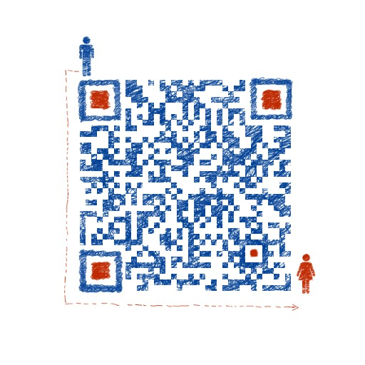

<body bgcolor="Pink" ></body>

<h1>欢迎来ZFX 1314的网页</h1>  

有这样一个女孩

	<audio controls="controls" height="100" width="100">  <source src="徐子洋、杨浩宇 - 有这样一个女孩.mp3" type="audio/mp3" />  
<embed height="100" width="100" src="徐子洋、杨浩宇 - 有这样一个女孩.mp3" />
</audio>

<i>  我是一名在校学生，我喜欢编程、网页编辑、电器修理(前面这些我只会一部分)…… 
  大家一定认为我会的很多，其实我会的并不是太多，只是比大多数同龄人多会的多一点点而已。 
  我之所以会的多一点都是因为我有一个什么都懂的哥哥(在我看来)，大家有意的话可以去我哥哥的博客网浏览浏览。</i>  

<b>由于我是新手和网站的原因，有可能会给你带来不便，望请见谅。</b>

<table border="1" >
<tr>
<td><a href="#C1">去应用区</a></td>
<td><a href="#C2">去音乐区</a></td>
<td><a href="#C3">去图片区</a></td>
</tr>
<tr>
<td><a href="#C4">需要帮助</a></td>
<td><a href="#C5">意见反馈</a></td>
</tr>
</table>

  

<a name="C1"><h2>应用</h2></a>

查看正在连接的WIFI密码神器。《WIFI二维码》<a href="com.eoe.wifishare.apk">点击下载</a>

修改软件图标和名称的多功能软件。《apk编辑器》<a href="你文件所在的路径就可以啦">文件名称</a>

手机root权限安装包:
《360超级root》，<a href="你文件所在的路径就可以啦">文件名称</a>
《king root》，<a href="你文件所在的路径就可以啦">文件名称</a>
《root工具箱》，<a href="你文件所在的路径就可以啦">文件名称</a>

正宗装逼神器(可以修改QQ标识)《畅玩手机》<a href="你文件所在的路径就可以啦">文件名称</a>

可以修改单机游戏数据的软件(需root)《re文件管理器》<a href="/img/RE管理器 rootexplorer.apk">点击下载</a>

《修改QQ运动步数》<a href="你文件所在的路径就可以啦">文件名称</a>

这是安卓终端模拟器<a href="com.termux.apk" download="com.termux.apk">点击下载</a>

可以刷QQ业务，黄钻，会员……掉价了<a href="http://www.3131km.com/index.htm" alt="点击跳转">此处前往</a>

可以免费申请QQ靓号。<a href="https://ssl.zc.qq.com/v3/index-chs.html?type=0" alt="点击前往">点击前往</a>

  
<a name="C2"><h2>音乐</h2></a>  

<a name="C3"><h2>图片</h2></a>  

<a name="C4"><h2>帮助</h2></a>  

大家好，在网页的个人介绍中，我已经声明<ins>我是新手</ins>
所以这个网页中的软件下载比较麻烦，sorry！如果你想下载其中的软件，
需要先按“点击下载”，然后会进入如下图所示的画面，再点击红色圆圈中的两个
单词即可下载！  

<a name="C5"><h2>反馈</h2></a>

<table border="1" >
<tr>
<th>QQ</th>
<td>2675699284</td>
</tr>
<tr>
<th>My另一个</th>
<td><a href="https://zfx539.github.io" alt="点击跳转">此处进入</a></td>
</tr>
<tr>
<th>My brother的网页</th>
<td><a href="https://zfb132.github.io" title="点击跳转">此处进入</a></td>
</tr>
</table>

扫描二维码可以加微信。有意见可以通过QQ或微信发给我。

  
  

